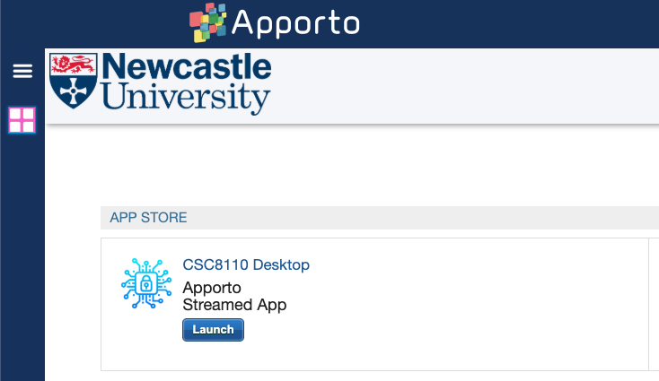
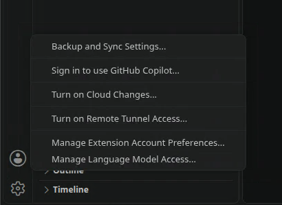
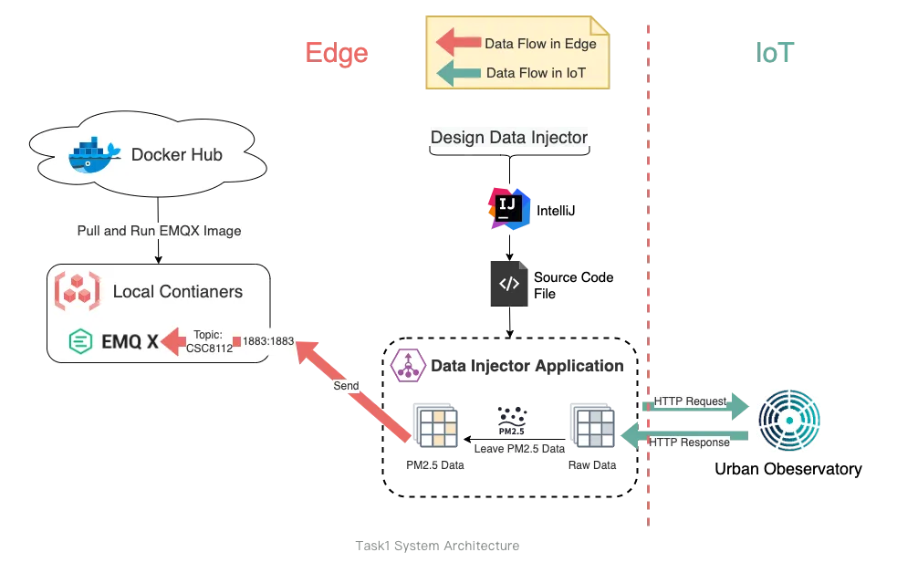
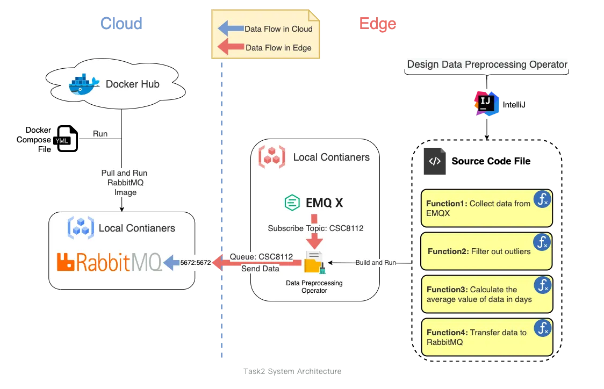
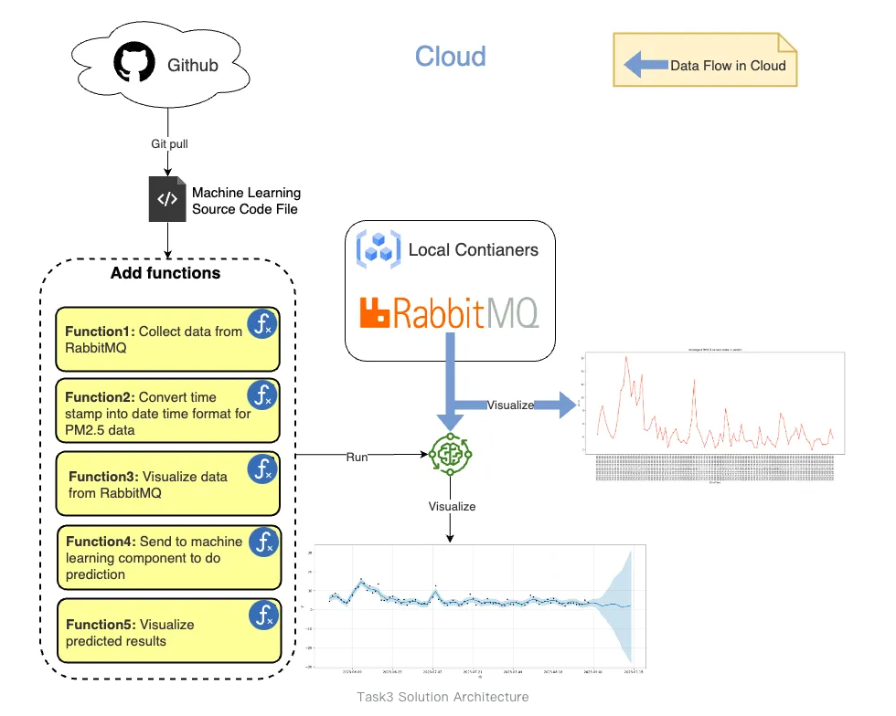
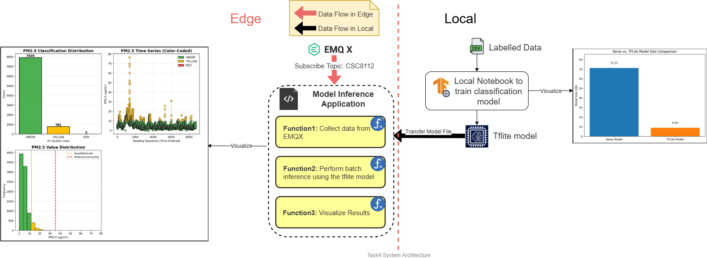

# CSC8112

| Table of contents |
| --- |
| [Getting started](#getting-started) |
| [File transfer from your computer](#file-transfer-from-your-computer) |
| [Provided software](#provided-software) |
| [Software and library needed for coursework](#software-and-libraries-needed-for-coursework) |
| [Docker images required for coursework](#docker-images-required-for-coursework) |
| [Architecture for each task](#architecture-for-each-task) |
| [Troubleshooting](#troubleshooting) |

## Getting started

Go to <https:://ncl.apporto.com> and login with your school account.

Click Launch to connect

## File transfer from your computer

This uses VS Code's Remote Tunnels feature to connect VS Code on your own computer to the Apporto VM, so you can transfer files between them.

> [!IMPORTANT]
> You will need VS Code installed on your OWN computer for this to work.

1. **In the Apporto VM**, launch VS Code and install the **Remote Tunnels** extension from the Extensions Marketplace.
2. **In the Apporto VM**, click the account icon in the bottom-left corner of VS Code and select **Turn on Remote Tunnel Access...**

    

3. Select **Install as a service**. Choose "use weak encryption" if prompted.
 > [!NOTE]
 > You can use your personal account for this step.
4. Choose either **Sign in with GitHub** or **Sign in with Microsoft**
5. Wait until VS Code reports that the tunnel is active (you'll see a notification, and the account icon will show a green tunnel indicator)
6. **On your own computer**, Open the Command Palette (`Ctrl+Shift+P` / `Cmd+Shift+P`) and run **Remote Tunnels: Connect to Tunnel...**
    * Sign in with the same account you used in the Apporto VM
    * Select the VM's tunnel from the list (it will be named after the VM's hostname)
7. Once connected, open the folder you want to work with on the VM (e.g. **File > Open Folder...**)
8. You can now drag and drop files between your computer and the VM directly in the VS Code Explorer, or use the integrated terminal to copy files across

## Provided software

> [!TIP]
> You have sudo privileges in the VM. If there's any additional software you need, you can install it here

You have the following software out of the box:

* Visual Studio Code
* Docker and docker compose
* Python 3

## Docker images required for coursework

> [!TIP]
> Copy the link below and type `docker import <url> <imagename>:latest` to import the image

* [Virtual camera](data/virtualcamera_amd64.tar)
  * Exposes at port 8081
* [Dashboard](data/dashboard_amd64.tar)
  * Exposes at port 8000

## Software and libraries needed for coursework

For Linux packages

* Python 3
  * `sudo apt install python3`
* pip
  * `sudo apt install python3-pip`

For Python packages

| Package name | Version |
| --- | --- |
| requests | 2.28.1 |
| paho-mqtt | 1.6.1 | 
| pika | 1.3.0 |
| prophet | 1.1.1 |
| matplotlib | 3.6.0 |
| tensorflow | 2.13.1 |
| numpy | 1.24.3 |

## Architecture for each task

> [!NOTE]
> Labelled data for task 4 - [Data](data/PM2.5_labelled_data.csv)

## Troubleshooting

### Docker logs failed to print output

Add `PYTHONUNBUFFERED=1` to your environment variable in your Docker image.
