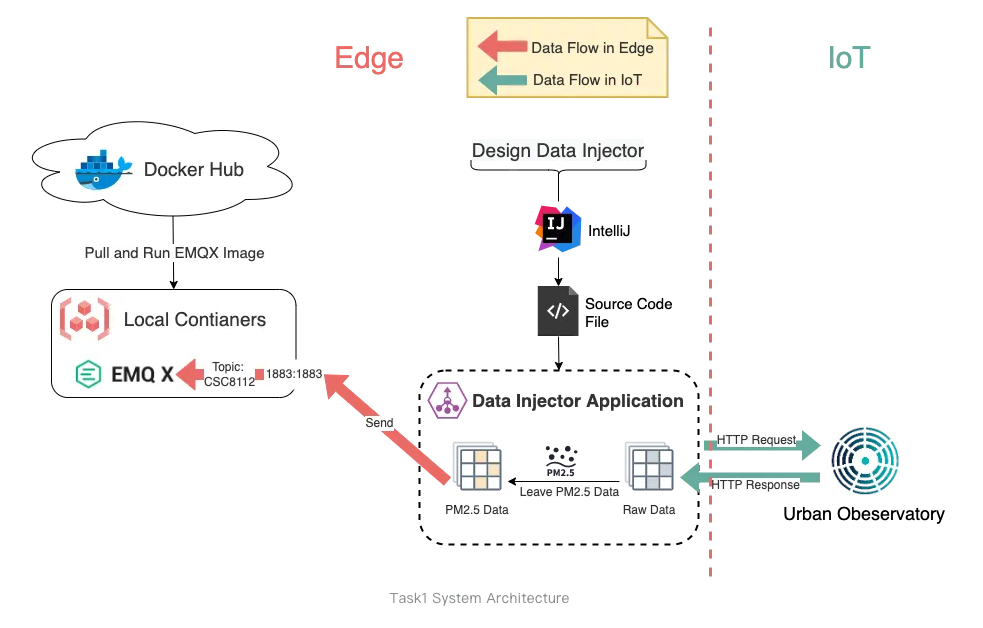

# CSC8112

| Table of contents |
| --- |
| [Getting started](#getting-started) |
| [Inside the Azure lab](#inside-the-azure-lab) |
| [Provided software](#provided-software) |
| [Software and library needed for coursework](#software-and-libraries-needed-for-coursework) |
| [Architecture for each task](#architecture-for-each-task) |
| [Troubleshooting](#troubleshooting) |

## Getting started

> [!WARNING]
> Remember to shut down the lab when you are not using it!

1. Access Azure lab at <https://labs.azure.com>. Login with your school account
2. Turn on the VM for CSC8112. This should take a few minutes
3. Click the toggle to turn it on and the computer icon to download an .rdp file
4. To access, prepare the following RDP clients
   * Windows: Nothing. Run the .rdp file directly
   * macOS: [Windows App from Mac App Store](https://apps.apple.com/gb/app/windows-app/id1295203466?mt=12)
   * Linux: Install Remmina from your package manager
5. For login use:
> [!NOTE]
> The username may sometimes be ~/student depending on the RDP client
   * Username: student
   * Password: CSC8112!

## Inside the Azure lab

> [!TIP]
> We recommend doing your work on the Windows host first, then transfer the files to the VM for faster performance.

Close the server manager, and you should see the desktop.

Open Hyper-V manager, and you should see two virtual machine labelled Cloud and Edge

Select the virtual machine here, click "Start" and "Connect"

## Provided software

> [!TIP]
> You have Administrator privleges in the Azure lab. If there's any additional software you need, you can install it here

You have the following software out of the box:

* MobaXterm
  * For transferring files from the Windows host to Linxu VM
* IntelliJ IDEA
  * Java IDE
* Docker and docker compose (In the VM)
* Python 3 (In the VM)

### Transferring files

#### From your computer to Azure lab

You can copy files and paste into the Azure lab

#### From Azure lab Windows host to Edge/Cloud VM

Open MobaXterm, you should see two configurations. Cloud and Edge.

Double click and enter the password. The file manager should appear on the left.

## Software and libraries needed for coursework

For Linux packages

* Python 3
  * `sudo apt install python3`
* pip
  * `sudo apt install python3-pip`

For Python packages

| Package name | Version |
| --- | --- |
| requests | 2.28.1 |
| paho.mqtt | 1.6.1 | 
| pika | 1.3.0 |
| prophet | 1.1.1 |
| matplotlib | 3.6.0 |
| tensorflow | 2.13.1 |
| numpy | 1.24.3 |

## Architecture for each task

## Troubleshooting

### VM Failed to restore

If you see this message box, click "Delete saved state" for that virtual machine before starting

> [!CAUTION]
> Be careful do not click "Delete"!

### Docker logs failed to print output

Add `PYTHONUNBUFFERED=1` to your environment variable in your Docker image.
